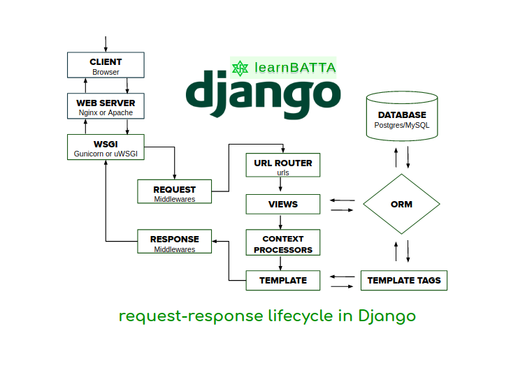

# Templat Proyek Django untuk Railway

Repositori ini berisi sebuah templat untuk membuat proyek Django yang siap di-*deploy* ke [Railway](https://railway.app/).

## Daftar Isi

- [Daftar Isi](#daftar-isi)
- [Instruksi Penggunaan](#instruksi-penggunaan)
- [Lisensi](#lisensi)
- [Referensi](#referensi)

## Instruksi Penggunaan

### Pengembangan Lokal

Apabila kamu ingin menggunakan repositori ini sebagai repositori awalan yang nantinya akan kamu modifikasi, ikuti langkah-langkah berikut.

1. Buka laman GitHub repositori templat kode, lalu klik tombol "**Use this template**"
   untuk membuat salinan repositori ke dalam akun GitHub milikmu.

2. Buka laman GitHub repositori yang dibuat dari templat, lalu gunakan perintah
   `git clone` untuk menyalin repositorinya ke suatu lokasi di dalam sistem
   berkas (*filesystem*) komputermu.

   ```shell
   git clone <URL ke repositori di GitHub> <path ke suatu lokasi di filesystem>
   ```

3. Masuk ke dalam repositori yang sudah di-*clone* dan jalankan perintah berikut
   untuk menyalakan *virtual environment*.

   ```shell
   python -m venv env
   ```

4. Nyalakan *virtual environment* dengan perintah berikut.

   ```shell
   # Windows
   .\env\Scripts\activate
   # Linux/Unix, e.g. Ubuntu, MacOS
   source env/bin/activate
   ```

5. Instal *dependencies* yang dibutuhkan untuk menjalankan aplikasi dengan perintah berikut.

   ```shell
   pip install -r requirements.txt
   ```

6. Jalankan aplikasi Django menggunakan server pengembangan yang berjalan secara lokal.

   ```shell
   python manage.py runserver
   ```

7. Bukalah `http://localhost:8000` pada browser favoritmu untuk melihat apakah aplikasi sudah berjalan dengan benar.

### Pengembangan di Railway

1. Buka situs web [Railway](https://railway.app/) dan klik tombol `Start a New Project`.

2. Klik pilihan `Deploy from GitHub repo`.

3. Klik tombol `Login With GitHub` dan masuklah ke dalam akun GitHub kamu.

4. Kamu akan kembali ke halaman pembuatan proyek baru. Klik pilihan `Deploy from GitHub repo` dan klik `Configure GitHub App`.

5. Pilih tempat kamu menyimpan repositori program ini dan klik `Install & Authorize`.

6. Kamu akan kembali ke halaman pembuatan proyek baru. Klik pilihan `Deploy from GitHub repo` dan pilih repositori program ini.

7. Klik `Add variables` dan buat variabel baru dengan nama `APP_NAME` dan isikan nama aplikasi kamu yang akan dibuat menjadi URL aplikasi.

8. Klik menu `Settings` dan ubahlah URL yang ada pada bagian `Domains` sesuai dengan `APP_NAME` yang telah dispesifikasikan sebelumnya.

9. Tekan Control + K atau Command + K dan pilih `New Service -> Database -> Add PostgreSQL` untuk menginisiasi basis data PostgreSQL sebagai basis data yang digunakan.

## Lisensi

Templat ini didistribusikan dengan lisensi [MIT](LICENSE).

## Referensi

- [django-template-heroku](https://github.com/laymonage/django-template-heroku)
- [Templat Proyek Django PBP](https://github.com/pbp-fasilkom-ui/django-pbp-template)
- [Pindah dari Heroku ke Railway](https://determinedguy.github.io/cecoret/heroku-to-railway/)


link railway : https://tugas2pbp.up.railway.app/tracker/


1. jelaskan  kaitan antara urls.py, views.py, models.py dan html

Secara umum, alur kerja dalam aplikasi Django adalah sebagai berikut: Ketika pengguna mengakses URL tertentu, Django akan mencari pola URL yang cocok di dalam file urls.py. Setelah menemukan pola URL yang cocok, Django akan memanggil view yang terhubung dengan URL tersebut. View kemudian akan memproses permintaan dan mengambil data dari model jika diperlukan. Setelah data diambil, view akan mempersiapkan output dan merender template HTML yang sesuai untuk ditampilkan ke pengguna.

2. Jelaskan kenapa menggunakan virtual environment? Apakah kita tetap dapat membuat aplikasi web berbasis Django tanpa menggunakan virtual environment?

virtual environment diperlukan sebagai pemisah/mengisolasi konfigurasi python pada proyek tertentu yang akan/sedang kita buat sehingga tidak bertabrakan dengan proyek python lainnya yang sudah ada/sedang berjalan pada komputer kita. virtual environment juga dapat membuat pengembangan aplikasi menjadi lebih mudah, karena Virtual environment memungkinkan kita untuk memisahkan lingkungan pengembangan dari lingkungan sistem utama, sehingga membuat pengembangan dan pengujian lebih mudah dan aman.

bisa kita membuat aplikasi tanpa harus menggunakan virtual environment. akan tetapi, hal ini dapat menyebabkan beberapa masalah dalam jangka panjang, terutama jika proyek kita berubah dan berkembang seiring waktu.

3. Jelaskan bagaimana cara kamu mengimplementasikan poin 1 sampai dengan 4 di atas.

kurang lebih sama persis saat saya mengerjakan tutorial, mengganti beberapa variabel seperti money tracker menjadi study tracker, transaction menjadi assignment pada berkas views, setting, html, urls. 

